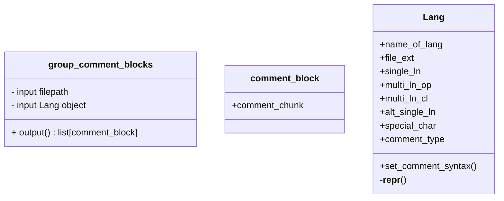

# Busy-Bee Classes and Functions

```mermaid
classDiagram

class group_comment_blocks{
    - input filepath
    - input Lang object
    + output() list[comment_block]
}
class comment_block
comment_block : +comment_chunk

class Lang{
    +name_of_lang
    +file_ext
    +single_ln
    +multi_ln_op
    +multi_ln_cl
    +alt_single_ln
    +special_char
    +comment_type
    +set_comment_syntax()
    -__repr__()
}

```
